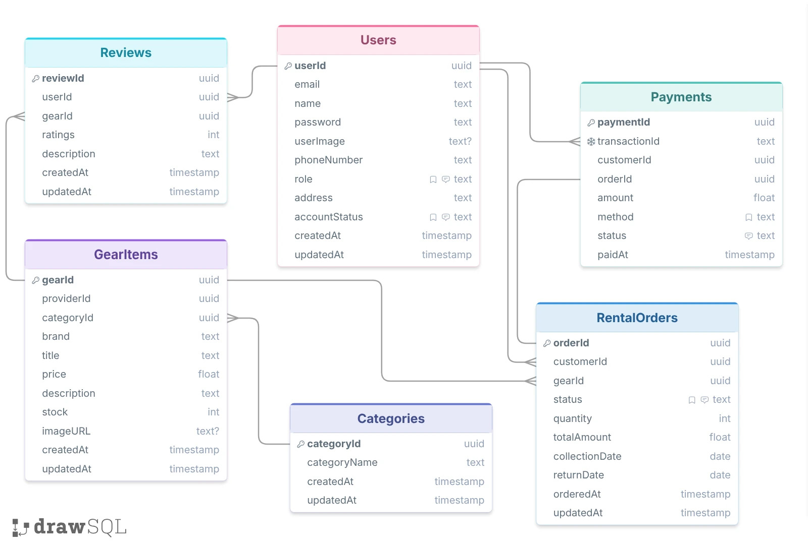

# 🚴‍♂️ GearUp Backend System

GearUp is a robust backend system built for an **Indoor & Outdoor Sports Gear Rental Platform**. It features complete API architectures for Role-Based Access Control (RBAC), gear inventory management, dynamic rental bookings, user reviews, and secure Stripe payment integration.

---

## 🔑 Key Information & Live Links

*   **Live API URL:** [https://a4-gearup.vercel.app/](https://a4-gearup.vercel.app/)
*   **API Documentation:** [https://documenter.getpostman.com/view/45061101/2sBY4JxiYY](https://documenter.getpostman.com/view/45061101/2sBY4JxiYY)
*   **API Collection:** `GearUp.postman_collection.json` (Available at the project root)
*   **Project Demonstration Video:** *[[Link](https://drive.google.com/file/d/1rsukCB5m1cBXT31NSh3eBZfFYgv-F8Zd/view?usp=sharing)]*

### 👤 Admin Demo Credentials
*   **Email:** `admin@gmail.com`
*   **Password:** `12345`

---

## 🛠️ Tech Stack & Dependencies

The core technical stack and package dependencies required to run this project are outlined below:

| Category | Technology / Package | Version | Usage |
| :--- | :--- | :--- | :--- |
| **Runtime & Language** | Node.js (ESM) / TypeScript | `^6.0.3` | Ensures strict type-safety and modern JavaScript runtime execution. |
| **Framework** | Express.js | `^5.2.1` | Manages server routing, requests, and asynchronous error handling. |
| **Database ORM** | Prisma ORM | `^7.8.0` | Handles type-safe queries and schema migrations with PostgreSQL (Neon DB). |
| **Payment Gateway** | Stripe | `^22.3.0` | Facilitates online checkout sessions and asynchronous Webhook event processing. |
| **Authentication** | JWT & Bcryptjs | `^9.0.3` / `^3.0.3` | Secures user passwords via hashing and manages stateless token authorization. |
| **Bundler & Tools** | tsup / tsx | `^8.5.1` / `^4.23.0` | Powers ultra-fast production bundling and real-time local hot-reloading. |

---

## 🗺️ Project ERD (Entity Relationship Diagram)

The database schema and relational mapping between tables are visualized below:

---
## ✨ Key Features & User Roles

This system implements strict **Role-Based Access Control (RBAC)** split across three distinct user roles, each having tailored capabilities:

### 👤 1. Customer Features
* **Browse & Search Gears:** Publicly access all available sports gear with advanced real-time pagination, brand filtering, and category matching.
* **Rental Bookings:** Seamlessly place rental orders by choosing desired collection dates, return dates, and product quantities.
* **Secure Payment Checkout:** Complete secure, one-click online card payments powered by the Stripe Checkout interface.
* **Reviews & Ratings:** Leave granular numerical ratings and detailed text feedback exclusively on items they have successfully rented.
* **Profile Management:** View personal account details, update profile information, and securely modify or change passwords.

### 🏢 2. Provider Features
* **Inventory Control (CRUD):** Full authorization to Create, Read, Update, and Delete (CRUD) their own sports gear items, including managing live stock levels, pricing, and descriptions.
* **Order Tracking:** Access and review a tailored log of all incoming customer rental orders placed specifically for their gear items.
* **Order Lifecycle Management:** Update order statuses (e.g., mark as `CANCELLED`) based on stock shortages or fulfillment conditions.

### 🛡️ 3. Admin Features
* **Platform Dashboard Overview:** Monitor and fetch comprehensive, system-wide data metrics including total global users, all gears, and overall platform rental orders.
* **Category Management:** Dynamically create new sports categories (e.g., Hiking, Indoor Sports) to systematically organize the storefront.
* **User Management & Moderation:** Access full user directories and moderate the platform by updating user accounts or blocking/suspending malicious accounts instantly.

---

